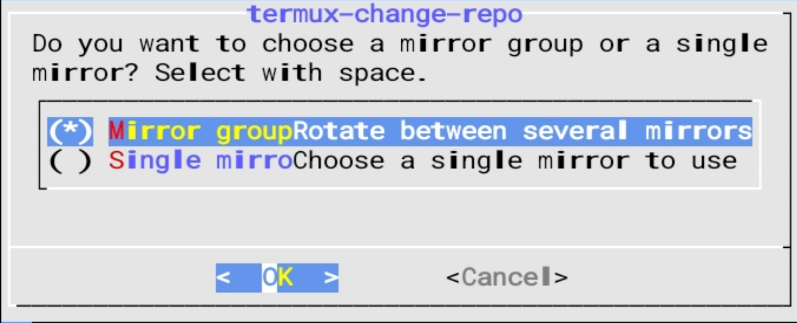
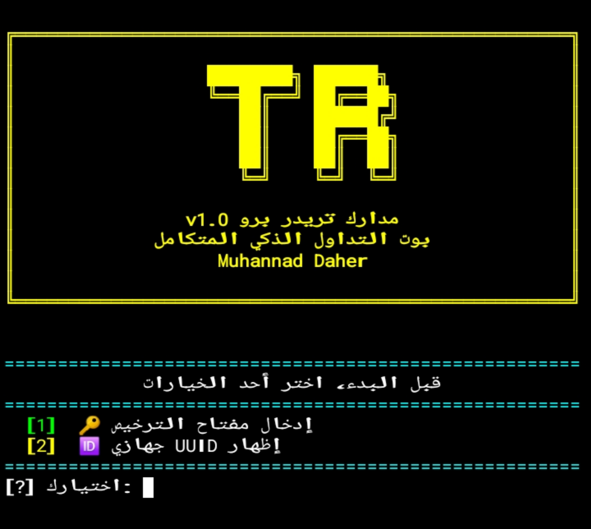
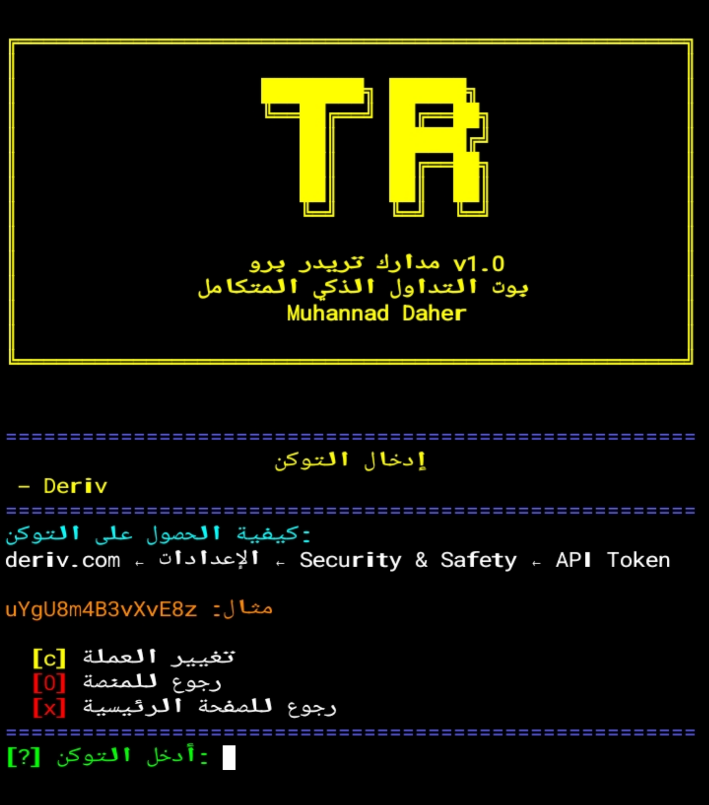
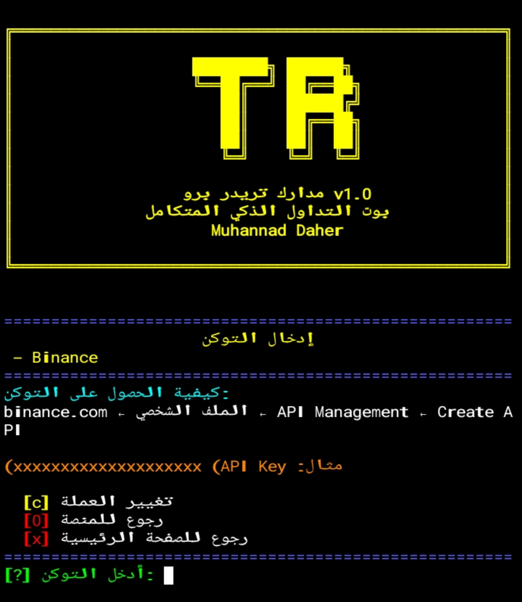
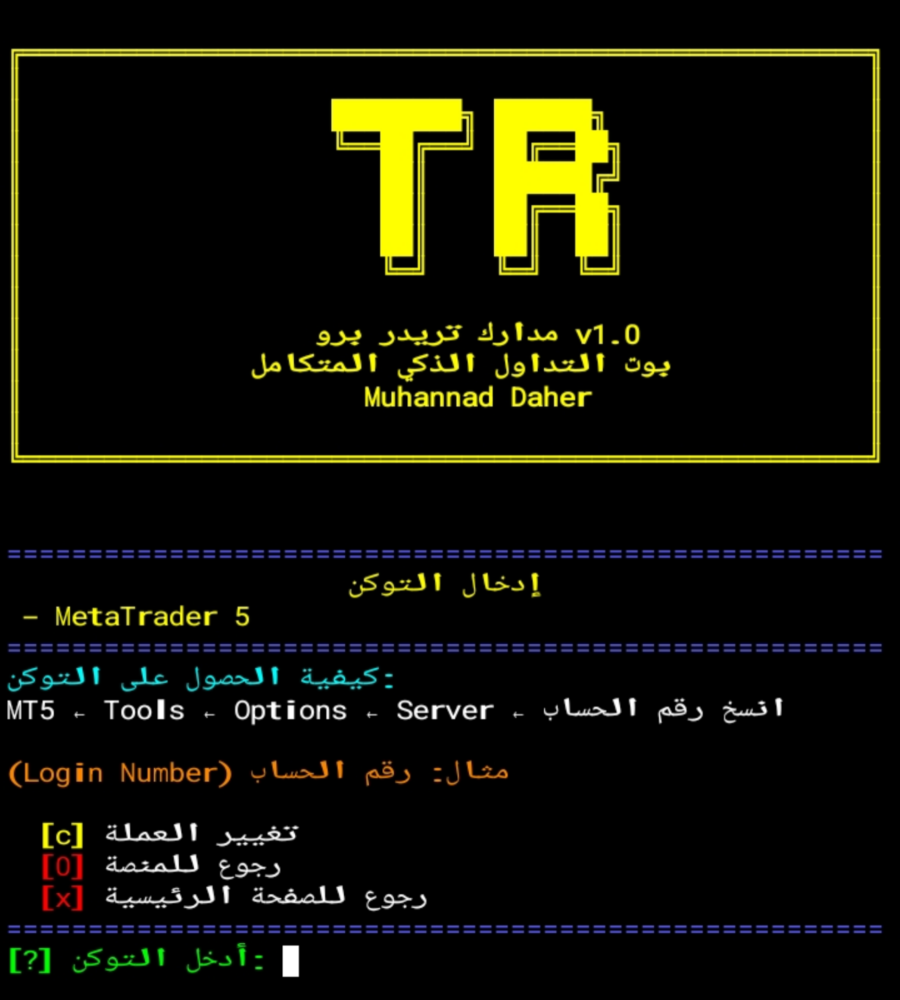
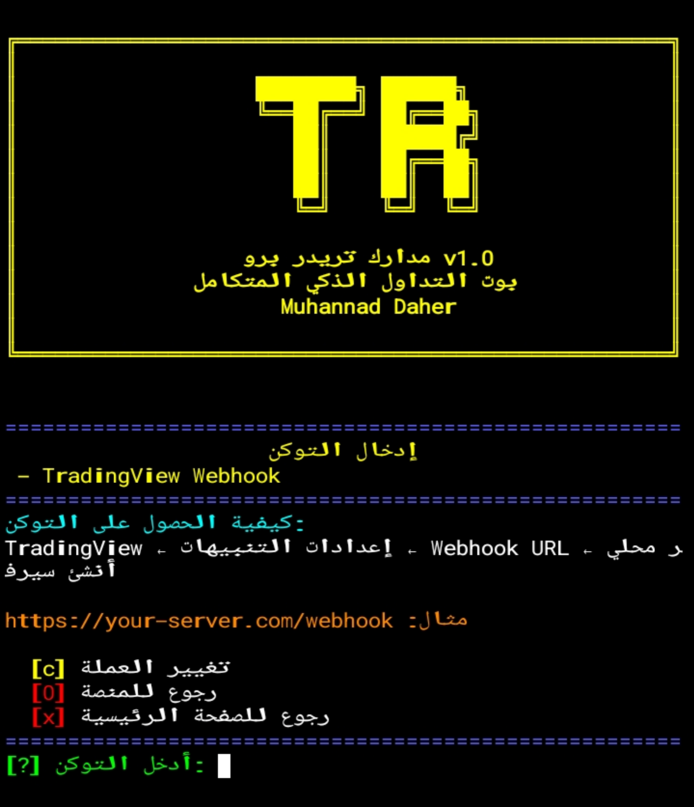
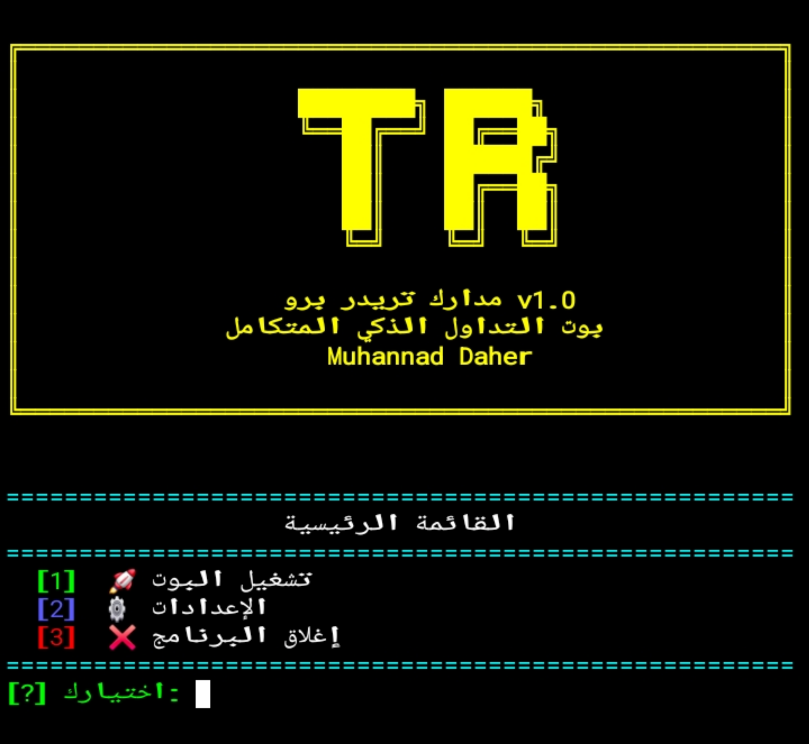

<div align="center">

# 🌟 مدارك تريدر برو

# بوت التداول الذكي المتكامل

---


[](https://github.com/mmuhacker)<br>
<br>
<br>
<br>
<br>
<br>


---

📋 المحتويات

</div>

- [المميزات](#-المميزات)
- [متطلبات التشغيل](#-متطلبات-التشغيل)
- [التثبيت](#التثبيت)
  - [التثبيت على 🤖 Termux](#-التثبيت-على-Termux)
  - [التثبيت على 🐉 Kali Linux](#التثبيت-على-kali-linux)
- [المشاكل الشائعة والحلول](#المشاكل-الشائعة-والحلول)
- [التشغيل](#-التشغيل)
- [تحديث الأداة](#-تحديث-الأداة)
- [التثبيت بأمر واحد](#-التثبيت-بأمر-واحد)
- [نظام الترخيص](#-نظام-الترخيص)
- [المنصات المدعومة](#-المنصات-المدعومة)
- [إستخراج التوكن](#-إستخراج-التوكن)
- [إنشاء سيرفر Webhook](#-إنشاء-سيرفر-webhook)
- [شرح القوائم](#-شرح-القوائم)
- [الفريم الزمني](#-الفريم-الزمني)
- [الأسواق المتاحة](#-الأسواق-المتاحة)
- [الإستراتيجيات](#-الإستراتيجيات)
- [قوة الإشارة](#-قوة-الإشارة)
- [لوحة التحكم](#-لوحة-التحكم)
- [اختصار التشغيل](#-إختصار-التشغيل)
- [دعم العملات المتعددة](#-دعم-العملات-المتعددة)
- [أخبار السوق](#-أخبار-السوق)
- [التنبيهات الصوتية](#-التنبيهات-الصوتية)
- [المطور](#-المطور)

───

<div align="center">

## ✨ المميزات

|#| الفئة | الميزات |
|----|-------|---------|
| 🔗| **المنصات** | Deriv, Binance, MetaTrader 5, TradingView Webhook |
| 💱| **العملات**|يدعم البوت 21 عملة متنوعة |
| 🎯| **الاستراتيجيات** | RSI+MA, MACD, Bollinger Bands, دعم/مقاومة, مجمّع |
| 📊| **قوة الإشارة** | 4 مستويات (65%-80%) |
| 🔊| **التنبيهات** | صوتية للإشارات والأرباح والخسائر |
| 📰| **الأخبار** | تحديثات مباشرة للسوق |
| ⏱| **الفريمات** | 5 أطر زمنية (1د - 60د) |
| 🔒| **الترخيص** | نظام متكامل يعمل بدون إنترنت |
| 🎨| **الواجهة** | عربية بالكامل مع ألوان احترافية |
| 📊| **اللوحة** | شاشة تحكم متكاملة في الوقت الفعلي |
| 💾| **الحفظ** | تلقائي للإعدادات والتوكنات |
| 🖥️| **البيئة** | Termux (Android) + Kali Linux |

---
<div align="center">
  
## ✅ متطلبات التشغيل

|#|المكتبة|الوصف|
|---|------|-------|
|1|Python 3x|لغة البرمجة الأساسية|
|2|websocket-client|الاتصال بخادم Deriv|
|3|rich|واجهة المستخدم الملونة|
|4|arabic-reshaper|تشكيل النص العربي|
|5|python-bidi|اتجاه النص من اليمين لليسار|

</div>

---
<div align="center" id="التثبيت">
  
## ⚡️ التثبيت


## 🔧 التثبيت على Termux

</div>

**الخطوة 1** — *تحديث النظام والمكتبات*
```bash
pkg update && pkg upgrade -y
```


**الخطوة 2** — *تثبيت Python والمكتبات الأساسية*

```bash
pkg install python curl tor -y
```


**الخطوة 3** — *إنشاء مجلد الخطوط*

```bash
mkdir -p ~/.termux
```


**الخطوة 4** — *تثبيت الخط العربي*

```bash
curl -L "https://fonts.gstatic.com/s/notonaskharabic/v33/RrQ5bpV-9Dd1b1OAGA6M9PkyDuVBePeKNaxcsss0Y7bwvc-VaA.ttf" -o ~/.termux/font.ttf && termux-reload-settings
```

⚠️ **هام:**  *بعد تثبيت الخط، أغلق Termux بالكامل من قائمة التطبيقات في الخلفية وأعد فتحه*

**الخطوة 5** — *تثبيت مكتبات Python*

```bash
pip install websocket-client rich arabic-reshaper python-bidi
```


**الخطوة 6** — *تنزيل الأداة*

```bash
curl -o $`PREFIX/bin/mud_tr.py https://raw.githubusercontent.com/mmuhacker/Mud-Treader/main/mud_tr.py
```

**الخطوة 7** — *إعطاء صلاحية التشغيل*

```bash
chmod +x `$PREFIX/bin/mud_tr.py
```

**الخطوة 8** — *إنشاء اختصار*

```bash
ln -sf $`PREFIX/bin/mud_tr.py `$PREFIX/bin/tr
```

---

<div align="center" id="التثبيت-على-kali-linux">

## 🐉 التثبيت على Kali Linux

</div>

**الخطوة 1** — *تحديث النظام*

```bash
sudo apt update && sudo apt upgrade -y
```

**الخطوة 2** — *تثبيت Python والمكتبات*

```bash
sudo apt install python3 python3-pip beep -y
```

**الخطوة 3** — *تثبيت مكتبات Python*

```bash
pip3 install websocket-client rich arabic-reshaper python-bidi
```

**ملاحظة: إذا ظهر خطأ externally-managed-environment، استخدم:**

```bash
pip3 install websocket-client rich arabic-reshaper python-bidi --break-system-packages
```

**الخطوة 4** — *تنزيل الأداة*

```bash
cd ~
curl -o mud_tr.py https://raw.githubusercontent.com/mmuhacker/Mud-Treader/main/mud_tr.py
```

**الخطوة 5** — *إعطاء صلاحية التشغيل*

```bash
chmod +x mud_tr.py
```

**الخطوة 6** — *إنشاء اختصار*

```bash
sudo ln -sf ~/mud_tr.py /usr/local/bin/tr
```

---

<div align="center" id="المشاكل-الشائعة-والحلول">

## ⚠️ المشاكل الشائعة والحلول

**Termux**

</div>

● المشكلة: pkg: command not found

○ الحل: تأكد من تثبيت Termux من F-Droid وليس من Google Play

● المشكلة: Connection reset by peer

○ الحل: تغيير المرآة 👇:
```bash
termux-change-repo
```
ثم اختر Mirror group كما تلاحظ في الشكل التالي:<br>

<div align="center">
  
📷 **تغيير المرآة**<br>



<i style="color: var(--color-fg-default);">الشكل 1: تغيير المرآة</i>

</div>

ثم قم بإختيار مرآة تكون قريبة من منطقتك كما تلاحظ في الشكل التالي:
<div align="center">
  
📷 **تغيير منطقة المرآة**<br>


<i style="color: var(--color-fg-default);">الشكل 2: تغيير منطقة المرآة</i>

</div>

──────
● المشكلة: Permission denied

○ الحل: نفّذ هذا الأمر 👇:
```bash
termux-setup-storage
```
وأعد تشغيل Termux

● المشكلة: النص العربي معكوس

○ الحل: ثبّت الخط العربي وأمر التثبيت موجود في الأعلى وأعد تشغيل Termux بالكامل بعد إغلاقه من التطبيقات في الخلفية وطريقة الخروج منه كالتالي أكتب 
```
exit
```
ثم Enter سيغلق مباشرة وربما يطلب منك التأكيد بالضغط على Enter بعدها تقوم بإغلاقه من قائمة التطبيقات في الخلفية. 

● المشكلة: No module named rich

○ الحل: تثبيت rich 👇
```bash
pip install rich
```
● المشكلة: 
ModuleNotFoundError: No modulenamed websocket

○ الحل: تثبيت websocket-client 👇
```bash
pip install websocket-client
```
● المشكلة:  pip: command not found

○ الحل: تثبيت بايثون 👇
```bash
pkg install python -y
```
● المشكلة: tor: command not found

○ الحل: تثبيت tor 👇
```bash
pkg install tor -y
```
● المشكلة: beep: command not found 
التنبيهات الصوتية اختيارية، يمكن تجاهلها
خطأ: Killed أثناء التثبيت المساحة غير كافية، احذف ملفات غير ضرورية: pkg clean

**Kali Linux**

● المشكلة: externally-managed-environment
○ الحل: إستخدم --> break-system-packages بهذا الشكل 👇:
```bash
pip3: command not found sudo apt install python3-pip -y
ModuleNotFoundError pip3 install <module_name> --break-system-packages
```

● المشكلة: الخط العربي لا يعمل )متقطع ومعكوس
○ الحل: نفذ هذا 👇
```bash
sudo apt install fonts-noto-core -y
```
---

<div align="center">

## 🚀 التشغيل

</div>

بالاختصار (تم إعداده مسبقاً)

```bash
tr
```

أو بالأمر الكامل (Termux)

```bash
python $`PREFIX/bin/mud_tr.py
```

أو بالأمر الكامل (Kali Linux)

```bash
python3 ~/mud_tr.py
```

───

<div align="center">

## 🔄 تحديث الأداة

</div>

**Termux:**

```bash
curl -o $PREFIX/bin/mud_tr.py https://raw.githubusercontent.com/mmuhacker/Mud-Treader/main/mud_tr.py && chmod +x $`PREFIX/bin/mud_tr.py
```

**Kali Linux:**

```bash
cd ~ && curl -o mud_tr.py https://raw.githubusercontent.com/mmuhacker/Mud-Treader/main/mud_tr.py && chmod +x mud_tr.py
```

───

<div align="center">

⚡ التثبيت بأمر واحد (Termux)

</div>

```bash
pkg update && pkg upgrade -y && pkg install python curl -y && pip install websocket-client rich arabic-reshaper python-bidi && curl -o `$PREFIX/bin/mud_tr.py https://raw.githubusercontent.com/mmuhacker/Mud-Treader/main/mud_tr.py && chmod +x $`PREFIX/bin/mud_tr.py && ln -sf `$PREFIX/bin/mud_tr.py $`PREFIX/bin/tr && mkdir -p ~/.termux && curl -L "https://fonts.gstatic.com/s/notonaskharabic/v33/RrQ5bpV-9Dd1b1OAGA6M9PkyDuVBePeKNaxcsss0Y7bwvc-VaA.ttf" -o ~/.termux/font.ttf && termux-reload-settings && echo "تم تثبيت Mud-Treader (tr) والخط العربي بنجاح!"
```

---

<div align="center">

## 🔑 نظام الترخيص

</div>

عند أول تشغيل يطلب البوت مفتاح ترخيص.

للحصول على مفتاح: تواصل مع المطور.

<div align="center">

https://img.shields.io/badge/%EF%BA%97%EF%BB%A4%EF%BA%8D%EF%BA%BB%EF%BB%A0%20%EF%BB%A3%EF%BB%8C%EF%BB%A8%EF%BA%8E-black?style=for-the-badge&logo=gmail&logoColor=red

📸 طلب مفتاح الترخيص




<i style="color: var(--color-fg-default);">الشكل 3: مفتاح الترخيص</i>

**مميزات نظام الترخيص:**

</div>

- ✅ التحقق التلقائي عبر الإنترنت
- ✅ يعمل بدون إنترنت بعد أول تفعيل
- ✅ يتوقف تلقائياً عند انتهاء الصلاحية
- ✅ 3 محاولات إدخال فقط

───

<div align="center">

## 🏦 المنصات المدعومة

|#|المنصة| النوع| الأسواق|
|---|-----|------|----------|
|1|Deriv| |فوركس + خيارات ثنائية + مؤشرات| 9 أسواق
|2|Binance|كريبتو|9 أزواج|
|3|MetaTrader 5| فوركس + ذهب + نفط + مؤشرات|9 أسواق|
|4|TradingView Webhook|إشارات خارجية|5 أسواق|

───

## 🔐 إستخراج التوكن

**Deriv**

</div>

1. سجّل دخولك على deriv.com
2. اذهب إلى الإعدادات (Settings)
3. اختر Security & Safety
4. اختر API Token
5. اضغط Create new token
6. اختر صلاحية Read و Trade
7. انسخ التوكن الظاهر

**مثال: uYgU8m4B3vXvE8z**

<div align="center">

📷 **توكن ديريف**




<i style="color: var(--color-fg-default);">الشكل 4: توكن ديريف</i>

───

Binance

</div>

1. سجّل دخولك على binance.com
2. اضغط على صورة ملفك الشخصي
3. اختر API Management
4. اضغط Create API
5. اختر System generated
6. أدخل اسماً واضغط Next
7. أكمل التحقق الأمني
8. انسخ API Key

⚠️ ملاحظة: احفظ الـ Secret Key فوراً لأنه لن يظهر مجدداً

<div align="center">

📷 **توكن بينانس**




<i style="color: var(--color-fg-default);">الشكل 5: توكن بينانس</i>

───

**MetaTrader 5**

</div>

1. افتح تطبيق MetaTrader 5
2. اذهب إلى Tools ← Options
3. اختر تبويب Server
4. انسخ رقم Login
5. أدخله في البوت عند الطلب

<div align="center">

📷 **توكن ميتا تريدر**




<i style="color: var(--color-fg-default);">الشكل 6: توكن ميتا تريدر</i>

───
## 🔧 خطوات إنشاء سيرفر Webhook
**منصة TradingView**


markdown
## 📡 إعداد TradingView Webhook

**ما هو Webhook؟**
لنعرف مهو Webhook هي طريقة لإرسال الإشارات من TradingView مباشرة إلى البوت الخاص بك عبر الإنترنت.

**خطوات الإعداد:**

**الخطوة 1:** *تثبيت Ngrok (لإنشاء رابط عام)*

**Termux**
```bash
pkg install ngrok -y
```
<br>
**Kali Linux**

```bash
sudo apt install ngrok -y
```

**الخطوة 2:** *تشغيل البوت في وضع Webhook*
```bash
tr
```
**اختر المنصة 4 (TradingView Webhook)**

**الخطوة 3: تشغيل Ngrok في نافذة جديدة**
```bash
ngrok http 5000
```

ستحصل على رابط مثل: https://abc123.ngrok.io

**الخطوة 4:** *إعداد التنبيه في TradingView*

1. افتح TradingView وأضف تنبيهاً (Alert)
2. اختر Webhook URL
3. أدخل رابط Ngrok متبوعاً بـ /webhook  بهذه الطريقة 👇
   https://abc123.ngrok.io/webhook
   <div align="center">

📷 **رابط السيرفر**




<i style="color: var(--color-fg-default);">الشكل 7: رابط السيرفر</i>

</div>


5. في حقل Message، أرسل البيانات بصيغة JSON:
```json
{
  "signal": "CALL",
  "price": "{{close}}"
}
```
**تنسيق الإشارات المقبولة**

|الإشارة |النوع |الوصف|
|----|----|--------|
|CALL|شراء|توقع إرتفاع السعر|
|PUT| بيع|توقع إنخفاض السعر|


⚠️ ملاحظة: حساب TradingView Pro مطلوب لإرسال Webhooks
---

الصفحة الرئيسية

1 → تشغيل البوت<br>
2 → الإعدادات<br>
3 → إغلاق البرنامج


<div align="center">

📷 **الصفحة الرئيسية**




<i style="color: var(--color-fg-default);">الشكل 5: الصفحة الرئيسية</i>

</div>

───

<div align="center">

## قائمة الإعدادات (6 خطوات)

|الخطوة| الخيارات|
|-----|--------|
|1 - المنصة| 1-4 للاختيار، 0 للرئيسية|
|2 - التوكن| إدخال التوكن، c للعملة، 0 للسابق، x للرئيسية|
|3 - العملة |1-21 للاختيار، 0 للسابق|
|4 - السوق |1-9 للاختيار، 0 للسابق، x للرئيسية|
|5 - الاستراتيجية| 1-5 للاختيار، 0 للسابق، x للرئيسية|
|6 - إعدادات الصفقة| المبلغ والمدة، 0 للسابق، x للرئيسية|


أثناء التشغيل
|الأمر|الوصف|
|--------|-----------|
|Ctrl + C| فتح قائمة التحكم|


**قائمة التحكم**
</div>

1 → متابعة تشغيل البوت<br>
2 → تغيير الإعدادات<br>
3 → إغلاق البرنامج


───

<div align="center">
  
## ⏱ الفريم الزمني

</div>

كلما كان الفريم أعلى، كانت الدقة أكبر لكن الانتظار أطول قبل أول صفقة

<div align="center">

|#|الفريم| الانتظار قبل أول صفقة| الوصف|
|---|-----|------|--------|
|1 |1 دقيقة| ~27 دقيقة| سريع - مناسب للمضاربة السريعة|
|2 |5 دقائق| ~135 دقيقة| متوازن - الأكثر استخداماً|
|3 |10 دقائق| ~270 دقيقة| جيد - دقة معقولة|
|4 |30 دقيقة| ~13 ساعة| محافظ - دقة عالية|
|5 |ساعة |~27 ساعة |آمن جداً - دقة عالية جداً|

───

## 📍 الأسواق المتاحة

**Deriv**

|#|الزوج| النوع|
|---|------|----|
|1 |EUR/USD| فوركس|
|2 |GBP/USD| فوركس|
|3 |USD/JPY| فوركس|
|4| AUD/USD| فوركس|
|5 |USD/CAD| فوركس|
|6| EUR/GBP| فوركس|
|7| مؤشر تقلب 100| مؤشرات|
|8 |مؤشر تقلب 75| مؤشرات|
|9| مؤشر تقلب 50| مؤشرات|

───

**Binance**

|#|الزوج| النوع|
|---|------|----|
|1 |BTC/USDT| كريبتو|
|2 |ETH/USDT| كريبتو|
|3| BNB/USDT| كريبتو|
|4| SOL/USDT| كريبتو|
|5 |XRP/USDT| كريبتو|
|6| ADA/USDT| كريبتو|
|7| DOGE/USDT| كريبتو|
|8| MATIC/USDT| كريبتو|
|9| LTC/USDT| كريبتو|

───

**MetaTrader 5**

|#|الزوج| النوع|
|---|------|----|
|1 |EUR/USD| فوركس|
|2 |GBP/USD| فوركس|
|3 |USD/JPY| فوركس|
|4 |AUD/USD| فوركس|
|5 |USD/CAD| فوركس|
|6 |EUR/GBP| فوركس|
|7 |XAU/USD| ذهب|
|8| النفط الخام| سلع|
|9 |داو جونز| مؤشرات|

───

## 🎯 الإستراتيجيات

|#|الاستراتيجية |الوصف|
|---|------|----------|
|1 |RSI + MA| مؤشر القوة النسبية مع المتوسط المتحرك|
|2 |MACD| تقاطع المتوسطات الأسية|
|3 |Bollinger Bands| نطاقات بولينجر العلوية والسفلية|
|4| دعم ومقاومة| أعلى وأدنى سعر في 20 شمعة|
|5 |مجمّع ⭐ |كل الاستراتيجيات معاً - الأدق|

───

## 💪 قوة الإشارة

|#|النسبة| الوصف|
|---|----|--------|
|1| 65% |متوازن - صفقات كثيرة، مخاطرة متوسطة|
|2| 70% |جيد - صفقات معقولة، مخاطرة منخفضة|
|3 |75% |محافظ - صفقات أقل، دقة عالية|
|4 |80%| آمن جداً - صفقات نادرة، دقة عالية جداً|

───

## 📊 لوحة التحكم

|العنصر| الوصف|
|------|----------|
|🤖 الحالة |آخر حدث في البوت|
|🏦 المنصة| المنصة المختارة|
|📍 السوق| الزوج المختار|
|🎯 الاستراتيجية| الاستراتيجية النشطة|
|💱 العملة |العملة الأساسية للعرض|
|💰 الرصيد |رصيد الحساب|
|📈 الربح |صافي الربح/الخسارة|
|📊 المؤشرات| RSI, MA, MACD, BB, دعم/مقاومة|
|⚡ الإشارة| توصية الشراء أو البيع|
|💪 قوة الإشارة| شريط من 0% إلى 100%|
💵 السعر| السعر الفوري المباشر|

───

## ألوان الإشارة

|اللون| المعنى|
|----|--------|
|🟢 أخضر |شراء قوي - صعود مؤكد|
|🔵 أزرق |شراء متوسط - صعود محتمل|
|🔴 أحمر |بيع قوي - هبوط مؤكد|
|🟠 برتقالي |بيع متوسط - هبوط محتمل|
|⏳ أبيض| انتظار - لا فرصة حالياً|

</div>

───

<div align="center">

💱 دعم العملات المتعددة

</div>

يدعم البوت 21 عملة لعرض الرصيد والأرباح:

<div align="center">

| # | العملة | الرمز | الاسم |
|---|----|----|--------|
| 1 | USD |`$ | دولار أمريكي |
| 2 | EUR | € | يورو |
| 3 | GBP | £ | جنيه إسترليني |
| 4 | JOD | JD | دينار أردني |
| 5 | AED | د.إ | درهم إماراتي |
| 6 | SAR | ﷼ | ريال سعودي | 
| 7 | QAR | ﷼ | ريال قطري |
| 8 | KWD | د.ك | دينار كويتي |
| 9 | BHD | د.ب | دينار بحريني |
| 10 | OMR | ر.ع | ريال عُماني |
| 11 | YER | ر.ي | ريال يمني |
| 12 | SDG | ج.س | جنيه سوداني |
| 13 | DZD | د.ج | دينار جزائري |
| 14 | LYD | ل.د | دينار ليبي |
| 15 | TND | د.ت | دبنار تونسي |
| 16 | MAD | د.م | درهم مغربي |
| 17 | IQD|د.ع|دينار عراقي|
|18 |SYP|ل.س|ليرة سورية|
|19| LBP| ل.ل| ليرة لبنانية|
|20| EGP| ج.م|جنيه مصري|
|21 |TRY| ₺| ليرة تركية|

</div>

💡 لتغيير العملة: أثناء إدخال التوكن، اضغط c ثم اختر رقم العملة من القائمة

───

<div align="center">

## 📰 أخبار السوق

</div>

يعرض البوت آخر الأخبار الاقتصادية في لوحة التحكم مباشرة، بما في ذلك:

- 🔴 أخبار عالية التأثير (قرارات الفائدة، بيانات البطالة)<br>
- 🟡 أخبار متوسطة التأثير (مبيعات التجزئة، الإنتاج الصناعي)<br>
- ⚪ أخبار منخفضة التأثير (تصريحات المسؤولين)

📌 يتم تحديث الأخبار تلقائياً كل دقيقة

───

<div align="center">

## 🔊 التنبيهات الصوتية

|#|الحدث| الصوت| الوصف|
|---|-----|------|------|
|1|🔔 إشارة جديدة| تنبيه واحد| عند ظهور إشارة قوية (≥65%)|
|2|🎉 |صفقة رابحة| تنبيهان |عند إغلاق صفقة بربح|
|3|❌ |صفقة خاسرة |ثلاثة تنبيهات| عند إغلاق صفقة بخسارة|

</div>

───

<div align="center">

## 🔧 اختصار التشغيل

Termux:

```bash
ln -sf $`PREFIX/bin/mud_tr.py `$PREFIX/bin/tr
```

Kali Linux:

```bash
sudo ln -sf ~/mud_tr.py /usr/local/bin/tr
```

</div>

للتشغيل: اكتب tr واضغط Enter

───

⚠️ تنبيه

⚠️ التداول ينطوي على مخاطر عالية. لا تستثمر أكثر مما تستطيع تحمل خسارته. هذه الأداة لأغراض تعليمية فقط.

───

<div align="center">

## 👨‍💻 المطور

**Muhannad Daher**

[](https://github.com/mmuhacker)<br>

[](mailto:madarik.ai.info@gmail.com)

</div>

───

· بوت التداول الذكي
· البيئة: Termux (Android) / Kali Linux
· الإصدار: v2.0
· الترخيص: تجاري

───
<div align="center">

**Madarik Tools — صُنع بالعربية**

⭐ **إذا أعجبتك الأداة، لا تنسَ النجمة!** ⭐

</div>
